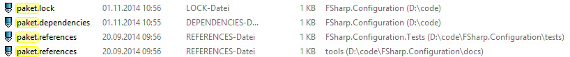

- title : Paket
- description : Introduction to Paket
- author : Steffen Forkmann
- theme : sky
- transition : default

***

### What is Paket?

- Dependency manager for .NET and Mono projects
- Allows to include NuGet packages and GitHub files

  
 

***

### Why another package manager?

- .NET ecosystem has already NuGet
- Integrated in Visual Studio and Xamarin Studio
- [nuget.org](https://www.nuget.org/) is etablished package feed

  
 

*** 

### Why another package manager?

- NuGet has no global view of your dependencies
- `packages.config` files are spread over all project folders
- As a sample [MassTransit](https://github.com/MassTransit/MassTransit):

  
 

*** 

### Why another package manager?
    
- NuGet has no concept of indirect dependencies
- Which packages do we really need?

    <?xml version="1.0" encoding="utf-8"?>
    <packages>
      <package id="Accord" version="2.14.0" targetFramework="net45" />
      <package id="Accord.Math" version="2.14.0" targetFramework="net45" />
      <package id="Accord.Neuro" version="2.14.0" targetFramework="net45" />
      <package id="AForge" version="2.2.5" targetFramework="net45" />
      <package id="AForge.Genetic" version="2.2.5" targetFramework="net45" />
      <package id="AForge.Math" version="2.2.5" targetFramework="net45" />
      <package id="AForge.Neuro" version="2.2.5" targetFramework="net45" />
      <package id="Deedle" version="1.0.1" targetFramework="net45" />
      <package id="Deedle.RPlugin" version="1.0.1" targetFramework="net45" />
      <package id="FSharp.Charting" version="0.90.6" targetFramework="net45" />
      <package id="FSharp.Data" version="2.0.9" targetFramework="net45" />
      <package id="FsLab" version="0.0.19" targetFramework="net45" />
      <package id="MathNet.Numerics" version="3.0.0" targetFramework="net45" />
      <package id="MathNet.Numerics.FSharp" version="3.0.0" targetFramework="net45" />
      <package id="R.NET.Community" version="1.5.15" targetFramework="net45" />
      <package id="R.NET.Community.FSharp" version="0.1.8" targetFramework="net45" />
      <package id="RProvider" version="1.0.13" targetFramework="net45" />
    </packages>

*** 

### Why another package manager?

- NuGet puts the version no. in the path
- Updates requires manual work (at least if you use .fsx):

    #I "packages/Deedle.1.0.1/lib/net40"
    #I "packages/Deedle.RPlugin.1.0.1/lib/net40"
    #I "packages/FSharp.Charting.0.90.6/lib/net40"
    #I "packages/FSharp.Data.2.0.9/lib/net40"
    #I "packages/MathNet.Numerics.3.0.0/lib/net40"
    #I "packages/MathNet.Numerics.FSharp.3.0.0/lib/net40"
    #I "packages/RProvider.1.0.13/lib/net40"
    #I "packages/R.NET.Community.1.5.15/lib/net40"
    #I "packages/R.NET.Community.FSharp.0.1.8/lib/net40"

***

### Why another package manager?

- NuGet doesn't allow to reference plain source files
- If you want to reuse code you have to create a package

***

### Why don't you contribute to NuGet?

- NuGet is open source, but managed by Microsoft
- Most changes are breaking (e.g. version no. in path) 
- NuGet team made clear they won't accept these changes

***

### Paket file structure

- `paket.dependencies`: Global definition of dependencies
- `paket.lock`: List of used versions for all dependencies
- `paket.references`: Dependency definition per project

  
 

***

### paket.dependencies

- Specifies all direct dependencies:

     source https://nuget.org/api/v2
           
     nuget Newtonsoft.Json         // any version
     nuget UnionArgParser >= 0.7   // x >= 0.7
     nuget log4net ~> 1.2          // 1.2 <= x < 2     
     nuget NUnit prerelease        // any version incl. prereleases
    

***

### paket.lock

- Graph of used versions for all dependencies
- Automatically computed from `paket.dependencies`:

    NUGET
      remote: https://nuget.org/api/v2
      specs:
        log4net (1.2.10)
        Microsoft.Bcl (1.1.9)
          Microsoft.Bcl.Build (>= 1.0.14)
        Microsoft.Bcl.Async (1.0.168) - >= net40 < net45
          Microsoft.Bcl (>= 1.1.8)
        Microsoft.Bcl.Build (1.0.21)
        Newtonsoft.Json (6.0.8)
        NUnit (3.0.0-alpha-4)
          Microsoft.Bcl.Async (>= 1.0.165) - >= net40 < net45
        UnionArgParser (0.8.2)

***

### paket.references

    Newtonsoft.Json
    UnionArgParser
    DotNetZip
    RestSharp

***

#### Convert from NuGet

- Automatic converter available

    $ paket convert-from-nuget

- finds all packages.config files
  - converts them to paket.references files
  - generates a paket.dependencies file with all dependencies
  - generates paket.lock file
- package restore process will be converted
- installs all packages

***

### Strict references

    references strict
    source https://nuget.org/api/v2
    
    nuget Newtonsoft.Json ~> 6.0
    nuget UnionArgParser ~> 0.7

***

- Slides are made with [FsReveal](http://fsprojects.github.io/FsReveal/)
- Send corrections to https://github.com/forki/PaketIntro