- title : Paket
- description : Introduction to Paket
- author : Steffen Forkmann
- theme : night
- transition : default

***

# Paket + git = ❤

  
 

- Steffen Forkmann
- @sforkmann
- github/forki

***

### Quiz: What's this?

    [lang=javascript]
    str = String(str);
  
    var i = -1;
  
    if (!ch && ch !== 0) ch = ' ';
  
    len = len - str.length;
  
    while (++i < len) {
      str = ch + str;
    }
  
    return str;    

***

### What is Paket?

- Dependency manager for all .NET and Mono projects
- Plays well with NuGet packages and [nuget.org](http://www.nuget.org)
- Allows to reference source code files from HTTP and GitHub
- Version 1.0 released at F# eXchange 2015 

  
 

***

### Why another package manager?

- .NET ecosystem has already NuGet
- Integrated in Visual Studio and Xamarin Studio
- [nuget.org](https://www.nuget.org/) is etablished package feed

  
 

*** 

### Why another package manager?

- NuGet has no global view of your dependencies
- `packages.config` files are spread over all project folders
- As a sample [MassTransit](https://github.com/MassTransit/MassTransit):

  
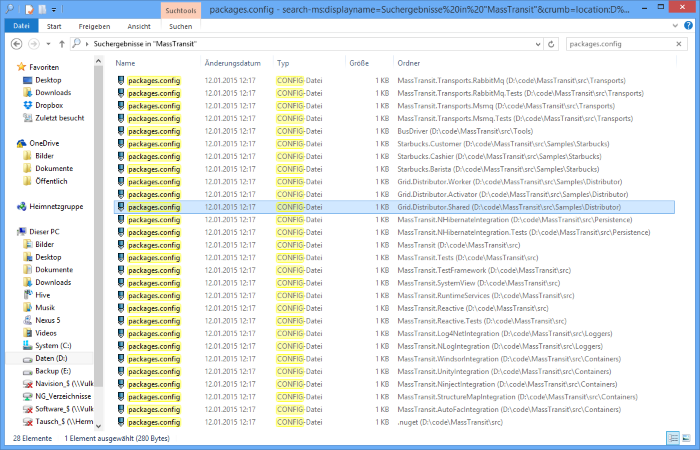 

*** 

### Why another package manager?
    
- NuGet has no concept of transitive dependencies

    <?xml version="1.0" encoding="utf-8"?>
    <packages>
      <package id="Accord" version="2.14.0" targetFramework="net45" />
      <package id="Accord.Math" version="2.14.0" targetFramework="net45" />
      <package id="Accord.Neuro" version="2.14.0" targetFramework="net45" />
      <package id="AForge" version="2.2.5" targetFramework="net45" />
      <package id="AForge.Genetic" version="2.2.5" targetFramework="net45" />
      <package id="AForge.Math" version="2.2.5" targetFramework="net45" />
      <package id="AForge.Neuro" version="2.2.5" targetFramework="net45" />
      <package id="Deedle" version="1.0.1" targetFramework="net45" />
      <package id="Deedle.RPlugin" version="1.0.1" targetFramework="net45" />
      <package id="FSharp.Charting" version="0.90.6" targetFramework="net45" />
      <package id="FSharp.Data" version="2.0.9" targetFramework="net45" />
      <package id="FsLab" version="0.0.19" targetFramework="net45" />
      <package id="MathNet.Numerics" version="3.0.0" targetFramework="net45" />
      <package id="MathNet.Numerics.FSharp" version="3.0.0" targetFramework="net45" />
      <package id="R.NET.Community" version="1.5.15" targetFramework="net45" />
      <package id="R.NET.Community.FSharp" version="0.1.8" targetFramework="net45" />
      <package id="RProvider" version="1.0.13" targetFramework="net45" />
    </packages>

*** 

### Why another package manager?

- NuGet puts the package version in the path
- Updates require manual work (at least if you use .fsx):

    #I "packages/Deedle.1.0.1/lib/net40"
    #I "packages/Deedle.RPlugin.1.0.1/lib/net40"
    #I "packages/FSharp.Charting.0.90.6/lib/net40"
    #I "packages/FSharp.Data.2.0.9/lib/net40"
    #I "packages/MathNet.Numerics.3.0.0/lib/net40"
    #I "packages/MathNet.Numerics.FSharp.3.0.0/lib/net40"
    #I "packages/RProvider.1.0.13/lib/net40"
    #I "packages/R.NET.Community.1.5.15/lib/net40"
    #I "packages/R.NET.Community.FSharp.0.1.8/lib/net40"

***

### Why don't you contribute to NuGet?

- NuGet is open source, but managed by Microsoft
- Most changes are breaking (e.g. version number in path) 
- NuGet team made clear they won't accept these changes

***

### Paket - Project Principles

- Integrate well into the existing NuGet ecosystem
- Make things work with minimal tooling (plain text files)
- Make it work on all platforms
- Automate everything
- Create a nice community

***

### Paket - Community

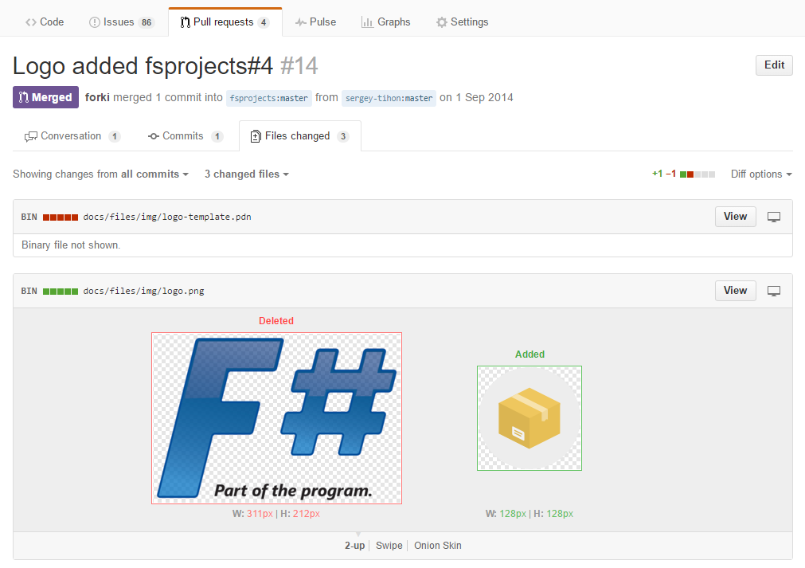

***

### Paket - Community

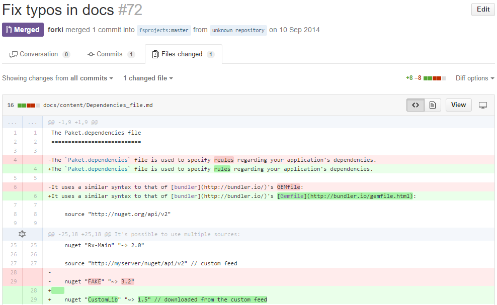 
 
***

### Paket - Community

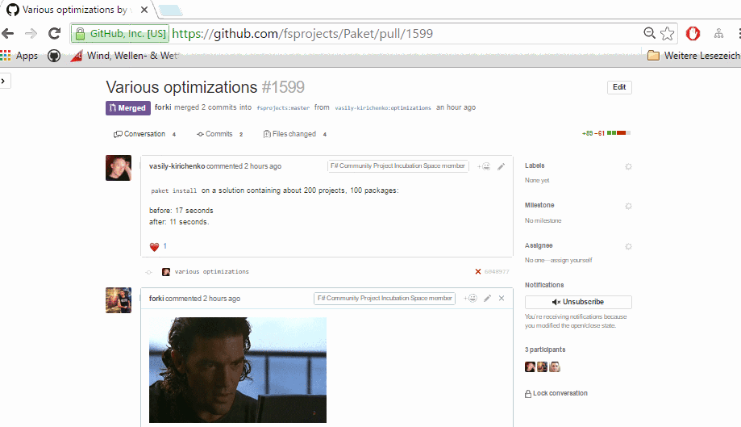 

***

### Paket - Community

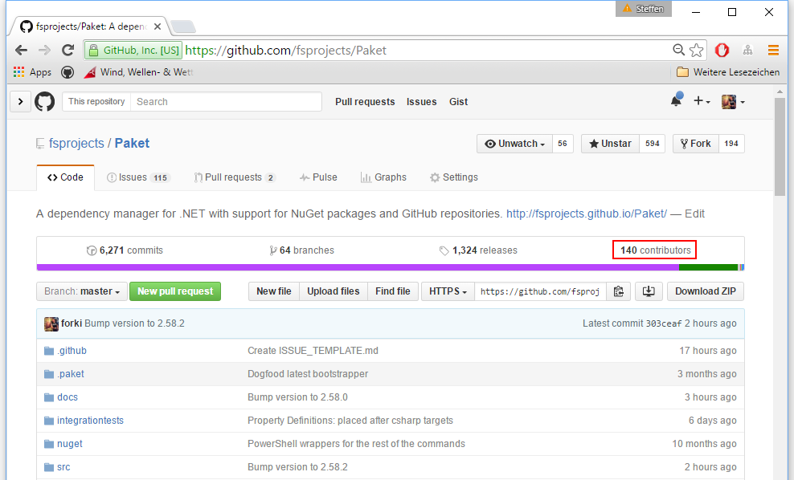 

***

### Paket file structure

- `paket.dependencies`: Global definition of dependencies
- `paket.lock`: List of used versions for all dependencies
- `paket.references`: Dependency definition per project   
- `paket.template`: Package definition for new packages

***

### paket.dependencies

- Specifies all direct dependencies
- Manually editable (or via paket.exe commands)

    [lang=paket]
    source https://nuget.org/api/v2
           
    nuget Newtonsoft.Json         // any version
    nuget UnionArgParser >= 0.7   // x >= 0.7
    nuget log4net ~> 1.2          // 1.2 <= x < 2     
    nuget NUnit prerelease        // any version incl. prereleases
    

***

### paket.lock

- Graph of used versions for all dependencies
- Compareable to a unified view of all `packages.config`
- Automatically computed from `paket.dependencies`:

    [lang=paket]
    NUGET
      remote: https://nuget.org/api/v2
        log4net (1.2.10)
        Microsoft.Bcl (1.1.9)
          Microsoft.Bcl.Build (>= 1.0.14)
        Microsoft.Bcl.Async (1.0.168) - >= net40 < net45
          Microsoft.Bcl (>= 1.1.8)
        Microsoft.Bcl.Build (1.0.21)
        Newtonsoft.Json (6.0.8)
        NUnit (3.0.0-alpha-4)
          Microsoft.Bcl.Async (>= 1.0.165) - >= net40 < net45
        UnionArgParser (0.8.2)

***

### paket.references

- Specifies which dependencies are used in a given project
- Compareable to `packages.config`, but without versions
- Only direct dependencies need to  be listed
- Manually editable

    [lang=paket]
    Newtonsoft.Json
    UnionArgParser
    NUnit

***

### Paket file structure

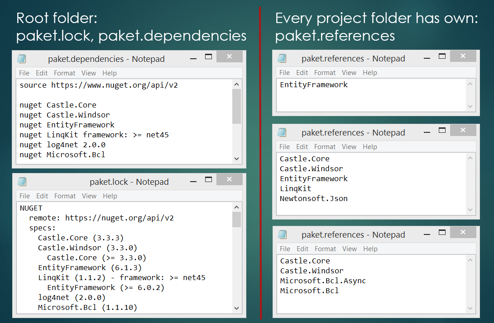 

***

### Installing packages

    $ paket install

- Computes `paket.lock` based on `paket.dependencies`
- Restores all direct and transitive dependencies
- Processes all projects and adds references to the libraries

***

### Checking for updates

    $ paket outdated

- Lists all dependencies that have newer versions available:

  
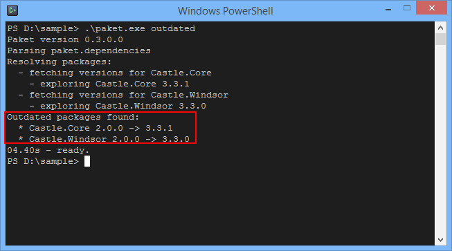 

***

### Updating packages

    $ paket update

- Recomputes `paket.lock` based on `paket.dependencies`
- Updates all versions to the latest matching all restrictions 
- Runs `paket install`

***

### Restoring packages

    $ paket restore

- Restores all direct and indirect dependencies
- Will not change `paket.lock` file
- Can be used for CI build or from inside Visual Studio

***

### Convert from NuGet

    $ paket convert-from-nuget

- Finds all `packages.config` files
  - Converts them to `paket.references` files
  - Generates `paket.dependencies` file
  - Computes `paket.lock` file
- Visual Studio package restore process will be converted
- Runs `paket install`

***

### Simplify dependencies

    $ paket simplify

- Computes transitive dependencies from `paket.lock` file  
  - Removes these from `paket.dependencies`
  - Removes these `paket.references`
- Especially useful after conversion from NuGet ([Sample](http://fsprojects.github.io/Paket/paket-simplify.html#Sample))

***

### Bootstrapping

- Don't commit `paket.exe` to your repository
- Bootstrapper is available for [download](https://github.com/fsprojects/Paket/releases/latest)
- Bootstrapper allows to download latest `paket.exe`
- Can be used for CI build or from inside Visual Studio

***

## Recap: Basic structure

- Command line tool over plain text
- Direct vs. transitive dependencies
- Only one version of a package

***

### Source code dependencies

- Allow to reference plain source code files
- Available for: 
  - [GitHub](https://www.github.com)
  - [GitHub gists](https://gist.github.com/)
  - HTTP resources
  
***

### Source code dependencies
#### GitHub sample (1)

- Add dependency to the `paket.dependencies` file 

    [lang=paket]
    github forki/FsUnit FsUnit.fs
    
- Also add a file reference to a `paket.references` file 

    [lang=paket]
    File:FsUnit.fs

***

### Source code dependencies 
#### GitHub sample (2)

- `paket install` will add a new section to `paket.lock`:

    [lang=paket]
    GITHUB
      remote: forki/FsUnit
        FsUnit.fs (7623fc13439f0e60bd05c1ed3b5f6dcb937fe468)

- `paket install` will also add a reference to the project:

  
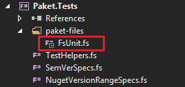

***

### Source code dependencies 
#### Use case - "Type Provider definition"

- For F# Type Providers you need a couple of helper files
- It was painful to keep these up-to-date
- Reference F# Type Provider files in `paket.dependencies`:

    [lang=paket]
    github fsprojects/FSharp.TypeProviders.StarterPack src/ProvidedTypes.fsi
    github fsprojects/FSharp.TypeProviders.StarterPack src/ProvidedTypes.fs
    github fsprojects/FSharp.TypeProviders.StarterPack src/DebugProvidedTypes.fs

- Add the files to the Type Provider's `paket.references`:

    [lang=paket]
    File:ProvidedTypes.fsi
    File:ProvidedTypes.fs
    File:DebugProvidedTypes.fs 
    
***

### Source code dependencies 
#### Use case - "Stanford.NLP.NET"

    [lang=paket]
    source https://nuget.org/api/v2
      
    nuget IKVM
    
    http http://www.frijters.net/ikvmbin-8.1.5717.0.zip
    http http://nlp.stanford.edu/software/stanford-corenlp-full-2015-12-09.zip
    http http://nlp.stanford.edu/software/stanford-ner-2015-12-09.zip
    http http://nlp.stanford.edu/software/stanford-parser-full-2015-12-09.zip
    http http://nlp.stanford.edu/software/stanford-postagger-full-2015-12-09.zip
    http http://nlp.stanford.edu/software/stanford-segmenter-2015-12-09.zip

http://sergey-tihon.github.io/Stanford.NLP.NET/

***

### Dependency Groups

- Allow for better organization of dependencies
- Enable easier conflict resolution

    [lang=paket]
    source https://nuget.org/api/v2
    
    nuget Newtonsoft.Json    
    github forki/FsUnit FsUnit.fs
    
    group Build
        source https://nuget.org/api/v2
        nuget FAKE    
        github fsharp/FAKE modules/Octokit/Octokit.fsx
    
    group Test
        source https://nuget.org/api/v2
        nuget NUnit
        nuget NUnit.Runners ~> 2

***

### Dependency Groups (paket.lock)

    [lang=paket]
    NUGET
      remote: https://nuget.org/api/v2
        Newtonsoft.Json (7.0.1)
    GITHUB
      remote: forki/FsUnit
        FsUnit.fs (81d27fd09575a32c4ed52eadb2eeac5f365b8348)
    GROUP Build
    NUGET
      remote: https://nuget.org/api/v2
        FAKE (4.3.1)
        ...
    GROUP Test
    NUGET
      remote: https://nuget.org/api/v2
        NUnit (2.6.4)
        NUnit.Runners (2.6.4)

***

### Quiz: What's this?

    [lang=javascript]
    str = String(str);
  
    var i = -1;
  
    if (!ch && ch !== 0) ch = ' ';
  
    len = len - str.length;
  
    while (++i < len) {
      str = ch + str;
    }
  
    return str;

***

### leftpad

    [lang=javascript]
    module.exports = leftpad;
    
    function leftpad (str, len, ch) {
      str = String(str);
    
      var i = -1;
    
      if (!ch && ch !== 0) ch = ' ';
    
      len = len - str.length;
    
      while (++i < len) {
        str = ch + str;
      }
    
      return str;
    }

***

### "How one developer just broke Node, Babel and thousands of projects in 11 lines of JavaScript"

 
<a href="http://www.theregister.co.uk/2016/03/23/npm_left_pad_chaos/">http://www.theregister.co.uk/2016/03/23/npm_left_pad_chaos/</a>

***

## This can happen to you!

* http://blog.nuget.org/20151007/Package-Content-and-Removals.html
* http://www.navision-blog.de/blog/2016/03/31/introducing-pakets-caching-feature-or-how-i-made-my-builds-reproducible-again/
                                                                                                   

***

### Additional Caches
#### (v3 Feature)

    [lang=paket]
    source https://nuget.org/api/v2
    cache //hive/dependencies
    
    nuget Newtonsoft.Json
    nuget UnionArgParser
    nuget FSharp.Core

***

### git dependencies 
#### (v3 Feature)

    [lang=paket]
    source https://nuget.org/api/v2
    
    nuget Newtonsoft.Json
    nuget UnionArgParser
    
    git http://github.com/forki/AskMe.git < 3.0
    
***

### git dependencies as NuGet source 
#### (v3 Feature)

    [lang=paket]
    git https://github.com/forki/AskMe.git < 3.0 Packages: /source/
    
    nuget AskMe

***

### git dependencies as NuGet source 
#### (v3 Feature)

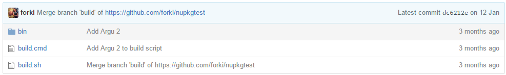

    [lang=paket]
    git https://.../test.git build:"build.cmd", Packages: /source/, OS:windows
    git https://.../test.git build:"build.sh", Packages: /source/, OS:mono

    nuget Argu
    
***

### git dependencies 
#### Use case - "Ionide"

    [lang=paket]
    source https://nuget.org/api/v2
    
    git https://.../ionide-vscode-helpers.git master build:"build.cmd"
    git https://.../FSharpFormatting.CLI.git master build:"build.cmd"
    git https://.../FsAutoComplete.git dotnetcore build:"build.cmd LocalRelease"
    git git@github.com:ionide/ionide-fsgrammar.git
    
    nuget FAKE
    nuget FunScript
    nuget Npm.js
     
***

### git dependencies 
#### Use case - "Ionide"

    [lang=paket]
    NUGET
      remote: https://www.nuget.org/api/v2
        FAKE (4.25.2)
        FunScript (1.1.94)
        ...
        Npm.js (2.13.1)
    GIT
      remote: https://github.com/ionide/ionide-vscode-helpers.git
         (b81a80ede2179222a5639cf866423d9bc6c2f0b4)
          build: build.cmd
      remote: https://github.com/ionide/FSharpFormatting.CLI.git
         (8b996684032cebe1ba052696fb30081fab023b1f)
          build: build.cmd
      remote: https://github.com/ionide/FsAutoComplete.git
         (8be5fa64fdd5b8f811c7dda1beaa3b861c5808b2)
          build: build.cmd LocalRelease
      remote: git@github.com:ionide/ionide-fsgrammar.git
         (8061b5296321522633b16d7df66af8cf5fcd3784)
    
***

### git dependencies 
#### Use case - "Ionide"

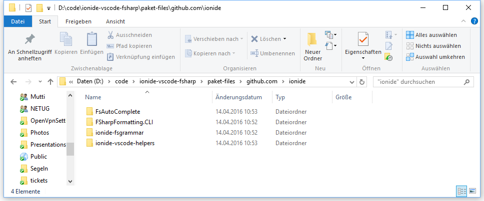

***

### git dependencies 
#### Use case - "Ionide"

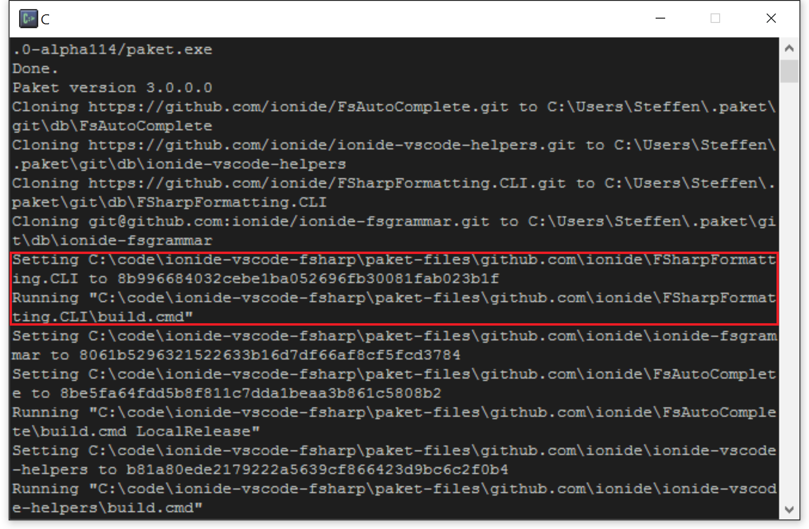

***

### git dependencies 
#### Use case - "Ionide"

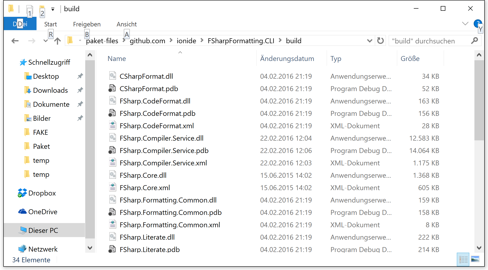

***

### Getting help

    $ paket [command] --help

- Visit the [online documentation](http://fsprojects.github.io/Paket/)
- Create a [GitHub issue](https://github.com/fsprojects/Paket/issues)
- Follow [PaketManager](https://twitter.com/PaketManager) on Twitter

***

### Paket.VisualStudio

- [VisualStudio plugin](https://github.com/hmemcpy/Paket.VisualStudio)

 
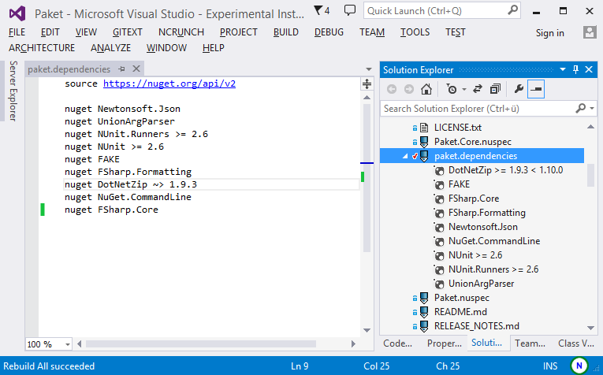

***

### Paket.XamarinStudio

- [Xamarin Studio plugin](http://addins.monodevelop.com/)

 
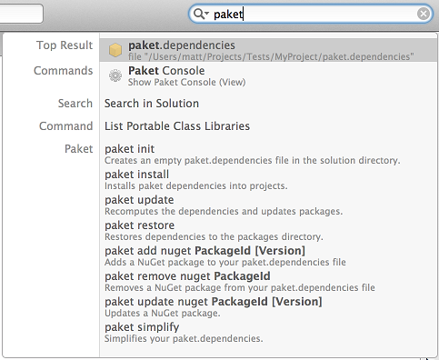

***

### Paket.Atom

-  Available in [Atom's plugin manager](https://atom.io/packages/paket)

 

***

### Paket.VSCode

-  Available in [VSCode's plugin manager](https://code.visualstudio.com/docs/editor/extension-gallery)

 

***

### Paket.Emacs

- Project site: [https://github.com/zzdtri/paket.el](https://github.com/zzdtri/paket.el)

 

### ProjectScaffold

- Allows a simple one step build and release process
- Works with most build servers
- Compiles the application and runs all test projects
- Synchronizes AssemblyInfo files prior to compilation
- Generates API docs based on XML documentation
- Generates documentation based on Markdown files
- Generates and pushes NuGet packages

- http://fsprojects.github.io/ProjectScaffold/

  
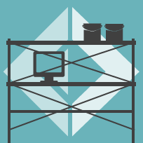 

***

### Paket.VisualStudio

- Alpha version of [VisualStudio plugin](https://github.com/hmemcpy/Paket.VisualStudio)

  
 

***

### Thank you

- Take a look at https://github.com/fsprojects/Paket
- We take contributions!
- Slides are MIT licensed and made using [FsReveal](http://fsprojects.github.io/FsReveal/)
- Send corrections to https://github.com/forki/PaketIntro
- Follow [@PaketManager](https://twitter.com/PaketManager)
